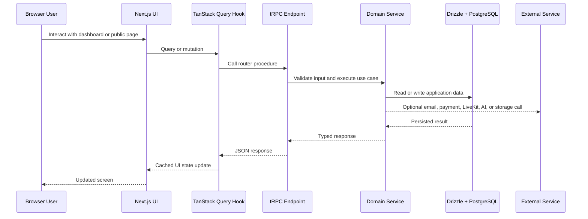

# Project Architecture Diagram

This diagram reflects the current mentor-mentee platform structure: Next.js App Router UI, tRPC business APIs, REST route handlers for multipart/webhook flows, Drizzle/Postgres persistence, and external service integrations.

```mermaid
flowchart TB
  subgraph Clients["Clients"]
    Browser["Web Browser"]
    AdminUser["Admin"]
    MentorUser["Mentor"]
    MenteeUser["Mentee"]
  end

  AdminUser --> Browser
  MentorUser --> Browser
  MenteeUser --> Browser

  subgraph NextApp["Next.js 16 App Router"]
    Pages["app/* pages\nLanding, dashboard, mentor signup, learning, sessions"]
    DashboardShell["components/dashboard\nRole-aware dashboard shell"]
    FeatureComponents["components/*\nAdmin, mentor, mentee, booking, messaging, content"]
    Providers["providers + contexts\nAuth, query, theme, app state"]
  end

  Browser --> Pages
  Pages --> DashboardShell
  DashboardShell --> FeatureComponents
  FeatureComponents --> Providers

  subgraph ClientData["Client Data Layer"]
    ReactQuery["TanStack Query hooks\nhooks/queries/*"]
    TRPCClient["tRPC React client\nlib/trpc/react"]
    DirectFetch["Direct fetch\nmultipart uploads, webhooks, legacy routes"]
  end

  FeatureComponents --> ReactQuery
  ReactQuery --> TRPCClient
  FeatureComponents --> DirectFetch

  subgraph ServerAPI["Server API Boundary"]
    TRPCRoute["app/api/trpc/[trpc]\nSingle tRPC endpoint"]
    RestRoutes["app/api/* route handlers\nUploads, mentor application, admin mentor creation,\nLiveKit webhooks, Razorpay webhooks, recordings"]
    BetterAuthRoutes["app/api/auth/[...better-auth]\nBetterAuth handlers"]
  end

  TRPCClient --> TRPCRoute
  DirectFetch --> RestRoutes
  Browser --> BetterAuthRoutes

  subgraph TRPCRouters["tRPC Routers"]
    AuthRouter["auth"]
    PublicRouter["public"]
    AdminRouter["admin"]
    MentorRouter["mentor"]
    ProfileRouter["profile"]
    BookingRouter["bookings"]
    ContentRouter["content"]
    LearningRouter["learning"]
    MessagingRouter["messaging"]
    NotificationsRouter["notifications"]
    PaymentsRouter["payments"]
    RecordingsRouter["recordings"]
    SubscriptionsRouter["subscriptions"]
    AnalyticsRouter["analytics"]
    ChatbotRouter["chatbot"]
  end

  TRPCRoute --> AuthRouter
  TRPCRoute --> PublicRouter
  TRPCRoute --> AdminRouter
  TRPCRoute --> MentorRouter
  TRPCRoute --> ProfileRouter
  TRPCRoute --> BookingRouter
  TRPCRoute --> ContentRouter
  TRPCRoute --> LearningRouter
  TRPCRoute --> MessagingRouter
  TRPCRoute --> NotificationsRouter
  TRPCRoute --> PaymentsRouter
  TRPCRoute --> RecordingsRouter
  TRPCRoute --> SubscriptionsRouter
  TRPCRoute --> AnalyticsRouter
  TRPCRoute --> ChatbotRouter

  subgraph Services["Server Domain Services"]
    AdminServices["lib/admin\nAdmin consoles, mentor verification,\nuser provisioning, policies"]
    MentorServices["lib/mentor\nMentor profile, availability,\napplication lifecycle"]
    BookingServices["lib/bookings + lib/meetings\nSession booking, policy checks,\nLiveKit meeting access"]
    ContentServices["lib/content + lib/courses + lib/learning\nMentor content, courses, enrollments,\nlearning analytics"]
    MessagingServices["lib/messaging\nThreads, permissions, SSE"]
    PaymentServices["lib/payments + lib/subscriptions\nRazorpay checkout, plans, limits"]
    ProfileServices["lib/profile\nMentee and mentor profile mapping"]
    NotificationServices["lib/notifications\nNotification records and delivery data"]
    AIChatbotServices["lib/chatbot\nAI chat flows and message insights"]
    RecordingServices["lib/recordings + lib/livekit\nRecording lifecycle and playback"]
  end

  AdminRouter --> AdminServices
  MentorRouter --> MentorServices
  ProfileRouter --> ProfileServices
  BookingRouter --> BookingServices
  ContentRouter --> ContentServices
  LearningRouter --> ContentServices
  MessagingRouter --> MessagingServices
  NotificationsRouter --> NotificationServices
  PaymentsRouter --> PaymentServices
  SubscriptionsRouter --> PaymentServices
  AnalyticsRouter --> AdminServices
  ChatbotRouter --> AIChatbotServices
  RecordingsRouter --> RecordingServices
  RestRoutes --> AdminServices
  RestRoutes --> MentorServices
  RestRoutes --> ContentServices
  RestRoutes --> PaymentServices
  RestRoutes --> RecordingServices

  subgraph Persistence["Persistence Layer"]
    Drizzle["Drizzle ORM\nlib/db"]
    Schema["Schema modules\nusers, roles, mentors, mentees,\ncontent, bookings, payments,\nnotifications, audit, availability"]
    Postgres["PostgreSQL\nDATABASE_URL"]
    Storage["Object Storage\nSupabase Storage or S3"]
  end

  AdminServices --> Drizzle
  MentorServices --> Drizzle
  BookingServices --> Drizzle
  ContentServices --> Drizzle
  MessagingServices --> Drizzle
  PaymentServices --> Drizzle
  ProfileServices --> Drizzle
  NotificationServices --> Drizzle
  AIChatbotServices --> Drizzle
  RecordingServices --> Drizzle
  BetterAuthRoutes --> Drizzle
  Drizzle --> Schema
  Schema --> Postgres

  MentorServices --> Storage
  ContentServices --> Storage
  RecordingServices --> Storage
  RestRoutes --> Storage

  subgraph External["External Services"]
    GoogleOAuth["Google OAuth"]
    LinkedInOAuth["LinkedIn OAuth"]
    SMTP["Email provider\nNodemailer SMTP"]
    Razorpay["Razorpay\nCheckout + webhooks"]
    LiveKit["LiveKit\nRooms, tokens, webhooks"]
    GoogleAI["Google AI SDK / Gemini\nChatbot and AI features"]
  end

  BetterAuthRoutes --> GoogleOAuth
  BetterAuthRoutes --> LinkedInOAuth
  AdminServices --> SMTP
  MentorServices --> SMTP
  PaymentServices --> Razorpay
  RestRoutes --> Razorpay
  BookingServices --> LiveKit
  RecordingServices --> LiveKit
  RestRoutes --> LiveKit
  AIChatbotServices --> GoogleAI

  subgraph CrossCutting["Cross-Cutting Concerns"]
    Guards["lib/api/guards\nRole checks for admin, mentor, mentee"]
    AccessPolicy["lib/access-policy\nRuntime access policy checks"]
    Audit["lib/audit + lib/db/audit\nAdmin, profile, session audit trails"]
    Validation["lib/validations + zod schemas\nInput contracts"]
  end

  TRPCRoute --> Guards
  RestRoutes --> Guards
  AdminServices --> AccessPolicy
  BookingServices --> AccessPolicy
  PaymentServices --> AccessPolicy
  AdminServices --> Audit
  MentorServices --> Audit
  BookingServices --> Audit
  TRPCRoute --> Validation
  RestRoutes --> Validation
```

## Primary Runtime Flow

