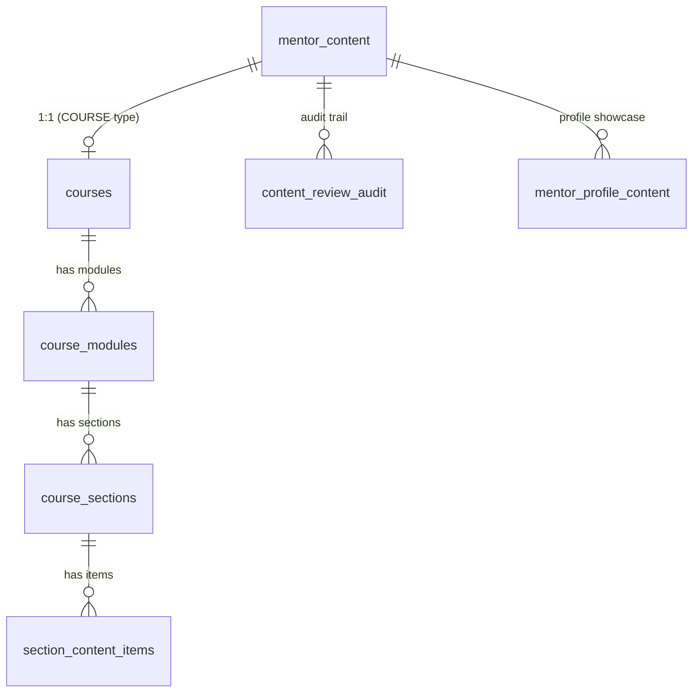
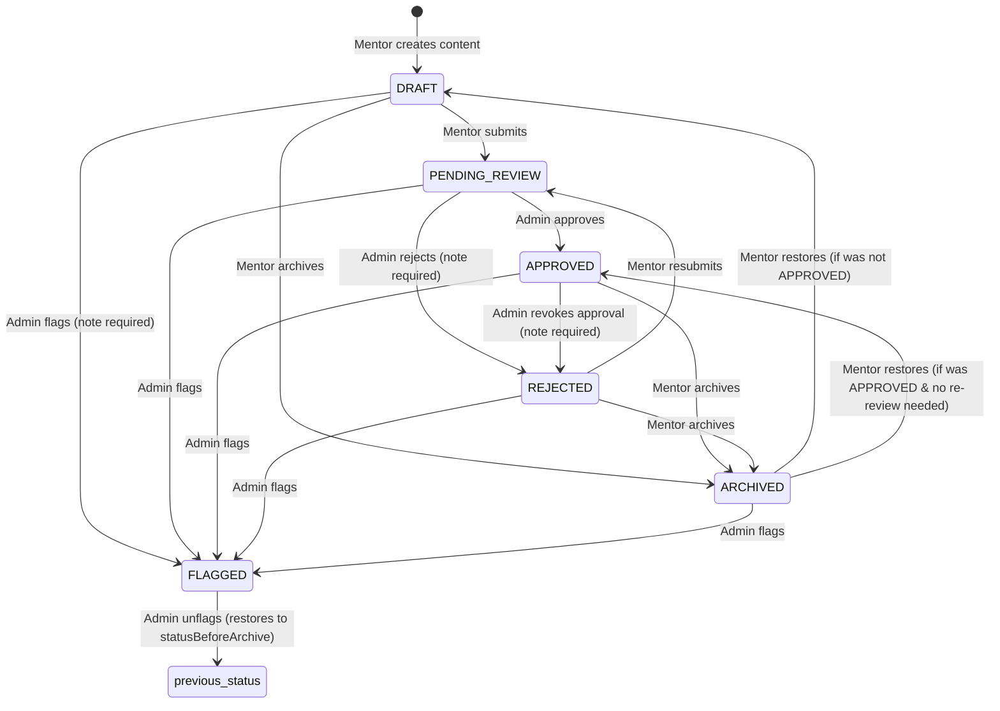

# Mentor Content System — Complete Analysis

## Data Model Overview

The content system is built on **7 database tables** defined in [mentor-content.ts](file:///c:/Users/Admin/young-minds-landing-page/lib/db/schema/mentor-content.ts):



| Table | Purpose |
|---|---|
| `mentor_content` | Root content record — every content item starts here |
| `courses` | Extended metadata for `COURSE` type content (difficulty, price, tags, etc.) |
| `course_modules` | Ordered modules within a course |
| `course_sections` | Ordered sections within a module |
| `section_content_items` | Individual learning items within a section (videos, PDFs, text, URLs) |
| `content_review_audit` | Immutable log of every status change and admin action |
| `mentor_profile_content` | Which approved content the mentor showcases on their public profile |

---

## Content Types

Defined by `content_type` enum:

| Type | Description | Extra Fields |
|---|---|---|
| `COURSE` | Structured multi-module course | Linked `courses` record with difficulty, price, tags, thumbnails + module/section/item hierarchy |
| `FILE` | Uploaded file (PDF, doc, etc.) | `fileUrl`, `fileName`, `fileSize`, `mimeType` |
| `URL` | External link/resource | `url`, `urlTitle`, `urlDescription` |

### Course Hierarchy

```
COURSE (mentor_content + courses)
  └── Module (course_modules) — ordered by orderIndex
        └── Section (course_sections) — ordered by orderIndex
              └── Content Item (section_content_items) — ordered by orderIndex
                    Types: VIDEO | PDF | DOCUMENT | URL | TEXT
```

### Course Ownership

Courses have an `owner_type` enum:
- **`MENTOR`** — Created by a mentor, linked to `ownerId` (mentor ID)
- **`PLATFORM`** — Created by an admin, `ownerId` is null

---

## Content Statuses & Lifecycle

Defined by `content_status` enum — **6 statuses**:



### Status Definitions

| Status | Meaning | Who can edit? | Visible to mentees? |
|---|---|---|---|
| `DRAFT` | Initial state, work in progress | ✅ Mentor can edit | ❌ No |
| `PENDING_REVIEW` | Submitted for admin review | ❌ Locked | ❌ No |
| `APPROVED` | Admin has approved | ❌ Cannot edit | ✅ Yes (if on profile) |
| `REJECTED` | Admin rejected (with feedback) | ✅ Mentor can edit & resubmit | ❌ No |
| `ARCHIVED` | Hidden but recoverable | ❌ Cannot edit | ❌ No |
| `FLAGGED` | Admin flagged for policy violation | ❌ Cannot edit | ❌ No |

> [!IMPORTANT]
> Only `DRAFT` and `REJECTED` statuses allow mentor edits — enforced by `mentorEditableContentStatuses` in [review-rules.ts](file:///c:/Users/Admin/young-minds-landing-page/lib/content/review-rules.ts#L19-L22).

---

## Mentor Actions (from the UI)

Defined in [content.tsx](file:///c:/Users/Admin/young-minds-landing-page/components/mentor/content/content.tsx#L75-L78):

| Action | Available When | Effect |
|---|---|---|
| **Edit** | `DRAFT` or `REJECTED` | Opens edit dialog |
| **Submit for Review** | `DRAFT` or `REJECTED` | Status → `PENDING_REVIEW`, clears `reviewNote`, logs audit |
| **Manage Course** | Content type is `COURSE` (any status) | Opens course builder |
| **Archive** | NOT `ARCHIVED` and NOT `PENDING_REVIEW` | Status → `ARCHIVED`, saves `statusBeforeArchive` |
| **Restore** | `ARCHIVED` only | Restores to previous status (APPROVED if it was approved & no re-review flag, otherwise DRAFT) |
| **Delete** | Any status | Soft delete: sets `deletedAt`, `purgeAfterAt` (30 days), `requireReviewAfterRestore = true` |

---

## Admin Review Actions

Defined in [review-rules.ts](file:///c:/Users/Admin/young-minds-landing-page/lib/content/review-rules.ts#L31-L43), implemented in [service.ts](file:///c:/Users/Admin/young-minds-landing-page/lib/content/server/service.ts#L1383-L1534):

| Action | Allowed From Statuses | Result Status | Note Required? |
|---|---|---|---|
| `APPROVE` | `PENDING_REVIEW` | `APPROVED` | No |
| `REJECT` | `PENDING_REVIEW` | `REJECTED` | **Yes** |
| `FLAG` | `DRAFT`, `PENDING_REVIEW`, `APPROVED`, `REJECTED`, `ARCHIVED` | `FLAGGED` | **Yes** |
| `UNFLAG` | `FLAGGED` | Restores to `statusBeforeArchive` | No |
| `FORCE_APPROVE` | `DRAFT`, `REJECTED`, `FLAGGED`, `ARCHIVED` | `APPROVED` | No |
| `FORCE_ARCHIVE` | `DRAFT`, `PENDING_REVIEW`, `APPROVED`, `REJECTED`, `FLAGGED` | `ARCHIVED` | No |
| `REVOKE_APPROVAL` | `APPROVED` | `REJECTED` | **Yes** |
| `FORCE_DELETE` | All statuses | `ARCHIVED` + soft delete (30-day purge) | **Yes** |

---

## Review Workflow Fields (`mentor_content` table)

| Column | Purpose |
|---|---|
| `submitted_for_review_at` | Timestamp when mentor submitted/resubmitted |
| `reviewed_at` | Timestamp of last admin review action |
| `reviewed_by` | User ID of admin who reviewed |
| `review_note` | Admin feedback (shown to mentor on rejection) |
| `flag_reason` | Reason for flagging (policy violation details) |
| `flagged_at` / `flagged_by` | Flagging metadata |
| `status_before_archive` | Saves previous status for restore/unflag operations |
| `require_review_after_restore` | If true, restoring forces status to DRAFT instead of original |

---

## Soft Delete & Retention

| Column | Purpose |
|---|---|
| `deleted_at` | When soft-deleted (null = not deleted) |
| `deleted_by` | Who deleted (mentor or admin user ID) |
| `delete_reason` | Why (e.g. "Deleted by mentor", "Deleted by admin") |
| `purge_after_at` | Hard delete deadline (30 days after `deleted_at`) |

When deleted:
- Status → `ARCHIVED`
- `requireReviewAfterRestore = true`
- Non-admin users cannot see the content
- Content is retained for 30 days before permanent purge

---

## Audit Trail (`content_review_audit`)

Every status change is logged as an immutable audit record:

| Audit Action | Triggered By |
|---|---|
| `SUBMITTED` | Mentor submits DRAFT for review |
| `RESUBMITTED` | Mentor resubmits REJECTED content |
| `APPROVED` | Admin approves |
| `REJECTED` | Admin rejects |
| `ARCHIVED` | Mentor archives or soft-deletes |
| `RESTORED` | Mentor restores from archive |
| `FLAGGED` | Admin flags for policy violation |
| `UNFLAGGED` | Admin removes flag |
| `FORCE_APPROVED` | Admin force-approves |
| `FORCE_ARCHIVED` | Admin force-archives |
| `APPROVAL_REVOKED` | Admin revokes approval |
| `FORCE_DELETED` | Admin force-deletes |

---

## Profile Content Showcase (`mentor_profile_content`)

- Mentors can select which **APPROVED** content to display on their public profile
- Only content with status `APPROVED` can be added to the profile showcase
- Ordered by `display_order`
- Managed via `updateProfileContent` which replaces the entire selection atomically

---

## Subscription Gating

> [!NOTE]
> Content creation subscription enforcement is **currently disabled** (`ENFORCE_CONTENT_SUBSCRIPTION = false` at [service.ts:100](file:///c:/Users/Admin/young-minds-landing-page/lib/content/server/service.ts#L100)).

When enabled, it would check:
- `CONTENT_POSTING_ACCESS` for FILE/URL content
- `COURSES_ACCESS` for COURSE content
